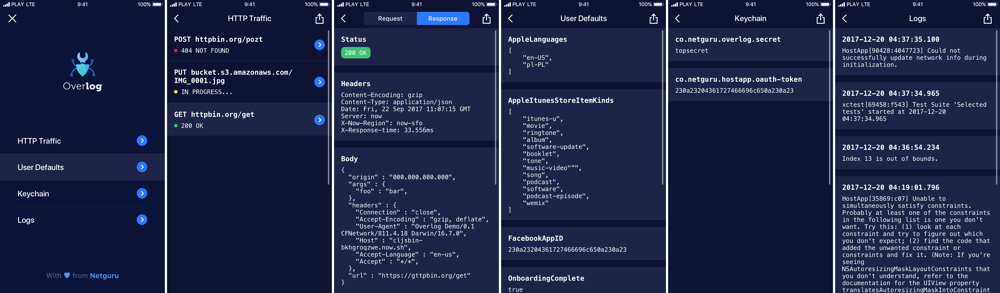

**Overlog** is an overlay for iOS apps that allows individual developers and teams to easier test and debug their apps.

## Features



### See your app's HTTP traffic

Overlog uses [ResponseDetective](https://github.com/netguru/ResponseDetective) to keep track of HTTP traffic happening inside your host application. Requests, responses and errors are grouped and updated live. You can take a look at their details, including headers and bodies for both request and responses and error details in case one occurs.

Having all this data under your fingertips might greatly improve testing and debugging issues related to network communication.

_In order to allow Overlog to inspect HTTP traffic, an additional line of code is required. Please read [usage section](#configure-http-traffic-debugging) for more information._

### Inspect User Defaults and Keychain items

Overlog scans your host app's User Defaults and Keychain Items and displays them to you in a clean key-value way.

### Read console logs

Overlog redirects the console output of your app into the visible UI so that you can use logs to get insight of what is happening to the state of your app.

### Easy export

All of the data shown by Overlog can be shared with your team with a single tap of a button.

### Extraordinary design

What makes Overlog special is its stunning and non-intrusive design.

### High configurability

All of the above features can be enabled and disabled by code. You have full control of what Overlog is allowed to display.

## Usage

### Attach Overlog to your key window

To use Overlog in your app, [install it](#installation), import it, and add the following code just after you set up your key window:

```swift
Overlog.shared.attach(to: window)
```

And... that's it! An Overlog button will appear on screen.

### Configure features

You can enable and disable features by modifying Overlog's configuration:

```swift
// Enable only HTTP Traffic feature.
Overlog.shared.configuration.enabledFeatures = [.httpTraffic]

// Enable only User Defaults and Keychain features.
Overlog.shared.configuration.enabledFeatures = [.userDefaults, .keychain]

// Enable all features (default).
Overlog.shared.configuration.enabledFeatures = Overlog.Feature.all
```

If you want your Keychain items to be inspected, you must let Overlog know what is its service identifier:

```swift
// Use custom keychain service identifier.
Overlog.shared.configuration.keychainIdentifier = "com.example.app.keychain-identifier"

// Use default keychain service identifier (default).
Overlog.shared.configuration.keychainIdentifier = nil
```

You may conditionally enable and disable features based on your target platform:

```swift
// Disable all features on simulator.
#if (arch(i386) || arch(x86_64)) && os(iOS)
    Overlog.shared.configuration.enabledFeatures = []
#endif
```

### Hide and show the overlay button

If you find the overlay button too intrusive, but don't want to remove Overlog completely, you may enable toggling it when user shakes the device:

```swift
// Enable shake gesture support.
Overlog.shared.configuration.toggleButtonOnShake = true

// Disable shake gesture support (default).
Overlog.shared.configuration.toggleButtonOnShake = false
```

You may also do hide and show the overlay button programatically:

```swift
// Hide the button.
Overlog.shared.isHidden = true

// Show the button (default).
Overlog.shared.isHidden = false
```

### Configure HTTP Traffic debugging

Last, but not least – in order to allow Overlog to inspect HTTP traffic, you must point to a session configuration instance to be inspected:

```swift
// Create a configuration.
let configuration = URLSessionConfiguration.default

// Enable HTTP traffic inspection.
Overlog.shared.enableHTTPTrafficDebugging(in: configuration)

// Create and normally use a session.
let session = URLSession(configuration: configuration)
```

## Requirements

Overlog requires **Xcode 9.3 or higher** and supports **iOS 8.0 or higher**.

## Installation

### Carthage

If you're using [Carthage](https://github.com/Carthage/Carthage), add the following dependency to your `Cartfile`:

```none
github "netguru/Overlog" {version}
```

### CocoaPods

If you're using [CocoaPods](http://cocoapods.org), add the following dependency to your `Podfile`:

```none
use_frameworks!
pod 'Overlog', '~> {version}'
```

## Contributing

### Ideas

If you have ideas of new features that could be supported in Overlog, feel free to [create an issue](https://github.com/netguru/Overlog/issues/new)!

### Pull Requests

Pull Requests from you (yes, you!) are always appreciated – no matter the size. We will respond and provide feedback to all Pull Requests!

### Development

Development requires the following tools to be installed:

- **[Xcode](https://github.com/KrauseFx/xcode-install) 9.3** using the latest **iOS 11.4 SDK**,
- **[Carthage](https://github.com/Carthage/Carthage) 0.28** or higher.

Assuming the above tools are present, clone the repository and install the project's dependencies using Carthage:

```sh
$ carthage bootstrap --platform iOS --cache-builds
```

After that, open `Overlog.xcodeproj` and build the project!

## Roadmap

#### Version 1.x

Next minor versions will focus on improving the existing features and fixing bugs. New features might be deferred until the next major version.

#### Version 2.0

The next major version will include support for Swift 5 and might possibly include a couple of big new features. Estimated release date: Fall 2018.

## About

This project is made and maintained with ♡ by [Netguru](https://netguru.co).

### License

Overlog is licensed under the [MIT License](LICENSE.md).
